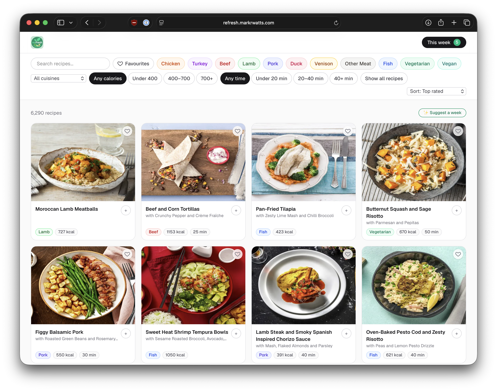
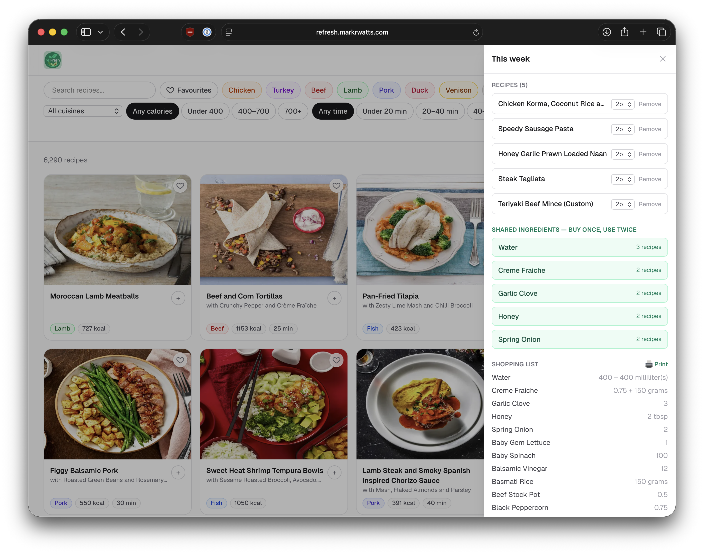
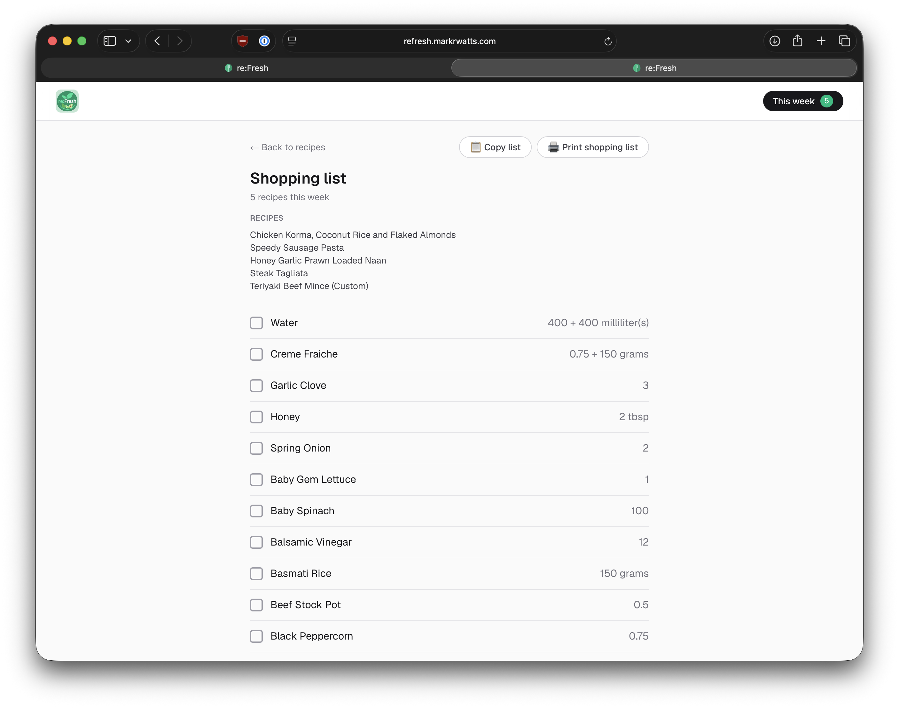

# re:Fresh

A web app for browsing HelloFresh (UK) recipes as cards and planning a week's meals around **shared ingredients**, to cut food waste and duplicate shopping. Multi-household: sign in with Google or a magic link, and each household keeps its own favourites, hidden recipes, and weekly plan against one shared recipe catalog.

Full phase-by-phase history, design rationale, and bugs found along the way: [`../reFresh-docs/project-plan.md`](../reFresh-docs/project-plan.md). This README is the practical "how to run and work on this project" reference.

|  |  |  |
|---|---|---|

> **About the data.** This is a personal, non-commercial project for my own household's meal planning. The scraper only fetches pages `hellofresh.co.uk/robots.txt` explicitly permits crawling, reading the same public sitemap and per-page structured data (`schema.org/Recipe` JSON-LD) any search engine would. No scraped content, database dump, or cache is included in this repository — `.cache/` and `db-backups/` are gitignored — and nothing here is redistributed publicly; the deployed instance is LAN-only, behind sign-in, for real households I know. If you're from HelloFresh and have a concern about this, please open an issue.

## Contents

- [Features](#features)
- [Stack](#stack)
- [Getting started](#getting-started)
- [Authentication & households](#authentication--households)
- [Populating the database](#populating-the-database)
- [Importing recipes from a scan](#importing-recipes-from-a-scan)
- [Deploying with Docker](#deploying-with-docker)
- [npm scripts](#npm-scripts)
- [Project structure](#project-structure)
- [Data model](#data-model)
- [How it works](#how-it-works)
- [Known limitations](#known-limitations)
- [License](#license)

## Features

- **Card browser** (hiringcafe-inspired): filter bar with protein type (Chicken/Turkey/Beef/Lamb/Pork/Duck/Venison/Other Meat/Fish/Vegetarian/Vegan, each colour-coded consistently everywhere), cuisine, calories, cook time, free-text search, a Favourites toggle, and a "show all" toggle that reveals near-duplicate recipes normally hidden behind their primary.
- **Recipe detail pages**: full ingredients list with a 2/3/4-person serving-size picker that scales quantities live, full nutrition breakdown, step-by-step instructions with photos where HelloFresh provides them, a link to similar variants, and a "Clone & customize" action.
- **Weekly planner** (persistent drawer): add/remove recipes, adjust each recipe's serving count independently, and see which canonical ingredients are shared across 2+ recipes, with a consolidated shopping list summed per matching unit.
- **Printing**: a dedicated print button on every recipe page (strips the app chrome down to just the recipe itself), and a separate printable, checklist-style shopping-list page linked from the planner — quantities reflect whatever serving counts you've set.
- **Auto-suggest**: given the currently active browse filters, greedily picks combinations of recipes that maximize shared ingredients (a real optimization, not just "recipes with similar names") — never repeats a recipe across the returned options.
- **Favourites**: heart-toggle on cards and the detail page, plus a filter — scoped per household (see below), not global.
- **Custom & imported recipes**: clone any recipe to edit, or import one from a scanned/photographed card — a "My recipe" / "From a card scan" badge distinguishes these from the scraped catalog. The full editor (name, subtitle, cook time, ingredients, nutrition, steps, cover photo) is available for any of these, with protein-type classification re-derived automatically as you edit, plus a confirm-guarded delete. See [Importing recipes from a scan](#importing-recipes-from-a-scan) for the two ways to do the import itself. Shared across every household, same as the rest of the catalog.
- **Hide auto-imported recipes**: reversible per-recipe hide (distinct from deleting, which is only for custom/imported recipes) with a "Hidden" filter to find and unhide them — per household, same as favourites.
- **Ingredient review** (`/ingredients/review`): admin tool for HelloFresh's inevitable naming/unit inconsistencies — rename/merge duplicate ingredients, tag categories, research real pack sizes so the shopping list can convert "1 pot" into a summable amount, and bulk-apply the resulting conversions across every affected recipe. Global (any signed-in user), not household-scoped — it's curating the shared catalog, not personal state. Not linked from the main nav; reach it directly at `/ingredients/review`.
- **Multi-household accounts**: Google or magic-link sign-in (Better Auth). Every household browses, plans, and clones from the exact same recipe catalog, but keeps its own favourites, hidden list, and this week's plan completely separate from every other household. From `/account`: rename the household, invite others by link, promote/demote/remove members, and delete your own account (deleting a household's sole owner's account takes the whole household with it — confirmed by typing its name). See [Authentication & households](#authentication--households).

## Stack

- **Next.js 16** (App Router, TypeScript) + **Tailwind v4** — almost entirely Server Components and Server Actions; the few client islands (toggle buttons, the plan drawer, filter bar, print button, servings pickers) are called out explicitly in the code. Note: Next 16 renamed Middleware to **Proxy** (`src/proxy.ts`, not `middleware.ts`) — the naming throughout this codebase and README follows that.
- **Prisma 7** + **PostgreSQL**, via `@prisma/adapter-pg` (Prisma 7 requires an explicit driver adapter).
- **Better Auth** (`src/auth.ts`) — Google OAuth + magic link (via Resend), plus its `organization` plugin renamed to Household/Member/Invitation for multi-household support. See [Authentication & households](#authentication--households).
- **A standalone scraper** (`scripts/scrape.ts`), decoupled from the request path: it populates Postgres from HelloFresh's public sitemap + per-page `schema.org/Recipe` JSON-LD (plus an internal app-data blob for richer per-step photos). The app itself never talks to HelloFresh live.
- Runs locally via `npm run dev`, or containerized via the included `Dockerfile` + `docker-compose.yml` — see [Deploying with Docker](#deploying-with-docker).

## Getting started

Prerequisites: Node.js, a local PostgreSQL server.

```bash
brew services start postgresql@16   # or use Docker instead — see below
createdb refresh_dev
npm install
cp .env.example .env                # adjust DATABASE_URL, and see "Authentication & households" for the rest
npx prisma migrate deploy           # applies every migration in prisma/migrations, in order
npm run dev
```

Open [http://localhost:3000](http://localhost:3000) — every route redirects to `/signin` until you're signed in and belong to a household; see [Authentication & households](#authentication--households) for what `.env` needs before that works. At this point the database schema exists but is empty — see [Populating the database](#populating-the-database) below.

`prisma migrate deploy` (not `migrate dev`) is what you want for a fresh database: it just replays the existing migration files non-interactively. `migrate dev` is for *generating new* migrations against a live dev database, and this project doesn't actually use it for that — see [How it works § schema migrations](#schema-migrations) for why.

## Authentication & households

Every route requires a signed-in session with household membership — [`src/proxy.ts`](src/proxy.ts) redirects everything except `/signin` and `/invite/[token]` to sign-in at the edge (a cheap cookie-presence check only; the real check is `auth.api.getSession()` against the database, done in each page/action). Sign-in itself is fully open — anyone can create an account and start their own household against the shared catalog; there's no email allowlist. A signed-in user with no household lands on `/onboarding` to create one or redeem an invite link.

`.env` needs, beyond `DATABASE_URL` (see `.env.example` for the full set with comments):

| Var | What it's for |
|---|---|
| `AUTH_SECRET` | Better Auth's session/cookie signing secret — `openssl rand -base64 32` |
| `AUTH_URL` / `AUTH_TRUSTED_ORIGINS` | Better Auth's own base URL (it doesn't infer this from the request) and CSRF origin allowlist — `http://localhost:3000` for local dev |
| `AUTH_GOOGLE_ID` / `AUTH_GOOGLE_SECRET` | Google OAuth client (Google Cloud Console → APIs & Services → Credentials → Web application), redirect URI `<AUTH_URL>/api/auth/callback/google` |
| `RESEND_API_KEY` | Sends magic-link emails via Resend's HTTP API (`src/lib/email.ts`) — the sending domain needs SPF/DKIM/DMARC verified in Resend |

Google sign-in works without `RESEND_API_KEY` set; magic-link sign-in doesn't need real Google credentials. Either alone is enough to develop against locally.

**Household model**: `Household`/`Member`/`Invitation` are Better Auth's `organization` plugin, renamed to this app's own domain language (see `src/auth.ts`). One household per user, enforced both at creation (`organizationLimit`) and invite-redemption time. Invites are redeemed by token (the invitation row's own id), not matched against the invitee's email — the email on an invitation is just a hint shown in the invite UI. `src/lib/require-member.ts`'s `requireMember()`/`requireMemberOrRedirect()` is the one place every mutating action and protected page resolves "which household is this for" — see [How it works § household-scoped data](#household-scoped-data) for why that matters more than usual here.

## Populating the database

Two ways to get real data, in order of preference:

1. **Restore a snapshot**, if you have one (`db-backups/refresh.dump` — gitignored, since it's tens of MB, so it won't exist on a fresh clone unless you copy it over from another machine):
   ```bash
   npm run db:restore
   ```
   This is seconds instead of the ~40-minute full crawl below.

2. **Run the scraper** against HelloFresh's public sitemap:
   ```bash
   npm run scrape -- --sample=50      # small sample first, sanity-check the output
   npm run scrape                      # full crawl (~16.5k recipe pages)
   npm run detect-variants             # cluster near-duplicate recipes (run after any (re-)scrape)
   ```
   Every fetched page is cached to disk (`.cache/hellofresh/html/`, gitignored), so re-running the scraper — or changing parsing/classification logic and running `npm run reprocess` — never re-hits the network for a page it's already seen. `npm run detect-variants` should be re-run any time the *browsable* recipe set changes (a fresh crawl, or a `computeIsBrowsable`/classification change), since it resets and recomputes `Recipe.variantOfId` for the whole catalog each time.

## Importing recipes from a scan

Two ways to turn a photographed/scanned recipe into a real, editable `Recipe` row — both share the same downstream persistence (image storage, ingredient resolution, protein classification, slugging), they only differ in how the card gets *read*.

### From the app (OCR, one card at a time)

Go to `/recipes/import` (linked from the card browser) and upload a **2-page** HelloFresh card PDF — front page (title/photo), back page (ingredients/method/nutrition). This is read automatically by `src/lib/pdfImport/parseCardPdf.ts` (Tesseract OCR over fixed-fraction crops, self-correcting against detected header text for layout drift — see [How it works](#how-it-works)), then lands on a review screen showing exactly what was read next to each field, with any low-confidence reads flagged as warnings. **Nothing is saved until you review and submit** — OCR on a scan is never perfect, so check the numbers (especially quantities and the nutrition table) before saving. Multiple files can be uploaded at once; each becomes its own pending draft to review separately, and a draft that fails to parse at all doesn't block the rest of the batch.

Only a handful of known HelloFresh card layouts are supported (`src/lib/pdfImport/regions.ts`'s `CARD_TEMPLATES`) — an unrecognized layout is rejected with a message to enter it manually instead via the recipe editor.

### Batch import via a Claude Code session (vision-based, no OCR)

For a batch of cards, cookbook photos, or anything an unsupported/imperfect OCR layout would mangle, `scripts/vision-import-prompt.md` is a self-contained runbook to paste into a fresh Claude Code session running in this repo. Instead of Tesseract, a vision-capable model reads the rendered page images directly — far more accurate in practice (correctly handles layout variants like a "Custom Recipe" swap block, single-serving legacy layouts, and even a plain photographed cookbook page with no nutrition data at all), and since the reading happens inside the Claude Code session itself rather than via a separate API call, it doesn't cost separate API credits.

```bash
# drop PDFs (or photos) into storage/pdf-import/inbox/, then paste
# scripts/vision-import-prompt.md as your first message to a fresh session
```

**There is no review screen on this path** — the session commits straight to the database via `npm run commit-vision-import -- <staging-dir>` (a thin wrapper around `src/lib/pdfImport/commitVisionImport.ts`), so accuracy depends entirely on the transcription being checked before committing, same as the runbook itself instructs. Useful for populating a fresh environment (e.g. mirroring recipes imported on a dev database across to production — copy each recipe's data + images into a staging folder matching `VisionCardData`'s shape, then run the same commit script against the target database).

## Deploying with Docker

For running this somewhere other than a dev machine — a home server or NAS — `Dockerfile` + `docker-compose.yml` build the app and run it alongside its own Postgres container. The image keeps the full `node_modules` tree (including `tsx`) rather than Next's pruned "standalone" output, specifically so the scraper scripts run inside the container the same way they do locally.

```bash
cp .env.docker.example .env.docker     # set a real POSTGRES_PASSWORD, plus the AUTH_*/RESEND_API_KEY vars
                                        # — see "Authentication & households" for what each one is
docker compose --env-file .env.docker up -d --build
```

The env file is named `.env.docker`, not `.env` — `.env` is the dev-server config (`DATABASE_URL` for `npm run dev`), and if you're building the image from a checkout that also runs the dev server locally (e.g. testing on the same machine you develop on), a plain `.env` would silently collide with it. `--env-file .env.docker` is needed on every `docker compose` invocation in this directory, not just `up`.

First boot: the `app` container runs `prisma migrate deploy` automatically before starting `next start`, so the schema exists but is empty. Populate it the same way as [above](#populating-the-database), just through `docker compose exec`:

```bash
docker compose --env-file .env.docker exec app npm run scrape -- --sample=50   # sanity check
docker compose --env-file .env.docker exec app npm run scrape                   # full crawl
docker compose --env-file .env.docker exec app npm run detect-variants
```

— or copy a snapshot onto the host into the `db-backups` volume (see below) and run `docker compose --env-file .env.docker exec app npm run db:restore`.

Sign in once (Google or magic link) to create your first `User` row, then either use `/onboarding` in the browser to create a household normally, or — if migrating existing favourite/hidden/plan data from a pre-auth deployment into a real multi-person household — run `scripts/backfill-household.ts` instead (see [DEPLOYMENT.md](DEPLOYMENT.md#multi-household-auth-phase-16) for the exact production sequence, since it has to run in a specific window between two schema migrations).

The app listens on port 3000 (`http://<host>:3000`); edit the `ports:` mapping in `docker-compose.yml` for a different host port. Three named volumes persist state across container rebuilds: `pgdata` (the database itself), `scraper-cache` (`.cache/`, so re-scrapes/reprocesses don't redownload pages already fetched), and `db-backups` (`npm run db:snapshot` output). On TrueNAS specifically, it's worth pointing these at a ZFS dataset via bind mounts instead of Docker-managed named volumes, so they pick up TrueNAS's own snapshot/replication — e.g. swap `pgdata:` for `/mnt/<pool>/refresh/pgdata:/var/lib/postgresql/data` under the `db` service.

To keep the catalog current, schedule `npm run scrape` (checks the sitemap for new/changed recipes) or `npm run reprocess` (zero network, just reapplies current parsing logic) periodically — e.g. a TrueNAS cron job (System Settings → Advanced → Cron Jobs) running:

```bash
docker compose -f /path/to/refresh/docker-compose.yml --env-file /path/to/refresh/.env.docker exec -T app npm run scrape
```

### Production (TrueNAS VM)

The app runs on a TrueNAS-hosted Ubuntu VM, behind a Caddy reverse proxy shared with other apps on the same box, with a real Let's Encrypt certificate (DNS-01 via acme-dns) — see [DEPLOYMENT.md](DEPLOYMENT.md) for the full setup.

## npm scripts

| Script | What it does |
|---|---|
| `npm run dev` | Start the Next.js dev server |
| `npm run build` / `npm run start` | Production build / serve |
| `npm run lint` | ESLint |
| `npm run scrape -- [flags]` | Crawl the HelloFresh sitemap into Postgres. Flags: `--sample=N` (stratified sample across the whole sitemap), `--limit=N` (stop after N *new* pages), `--concurrency=N` (default 5), `--delay-ms=N` (default 200, politeness delay between live fetches), `--force` (re-process every sitemap URL even if already up to date) |
| `npm run reprocess` | `scrape --force`, but every page is already cached — reapplies current parsing/classification logic to the whole catalog with **zero network requests**. This is the standard way to backfill a code change (see [How it works](#how-it-works)) |
| `npm run detect-variants` | Re-cluster near-duplicate recipes across the whole browsable catalog |
| `npm run detect-ingredient-merges -- --dry-run` | Report-only scan for likely duplicate/misspelled ingredient names (exact-match, close-spelling, and substring-variant tiers) — surfaces candidates for the ingredient review page's rename/merge UI, never merges anything itself |
| `npm run merge-ingredients -- --dry-run` | Re-canonicalizes every `Ingredient` and merges any that now collide — the catch-up for existing data whenever `canonicalizeIngredientName`'s rules change |
| `npm run reparse-ingredient-lines -- --dry-run` | Re-runs the ingredient-line parser against every stored `rawText` and fixes any row whose quantity/unit now comes out different — the catch-up for parser/unit-normalization changes |
| `npm run delete-unused-ingredients` | Removes `Ingredient` rows with zero `RecipeIngredient` usages (e.g. left behind after a merge or a reparse) |
| `npm run import-pdf -- <path.pdf> [--dump-crops <dir>]` | Debug entry point for the OCR card parser — prints what was read from one PDF (optionally dumping its cover/step-photo crops) without touching the database |
| `npm run commit-vision-import -- <staging-dir> [servingIndex]` | Commits one vision-transcribed card (a `data.json` + its referenced images in `<staging-dir>`) straight into the database — see [Importing recipes from a scan](#importing-recipes-from-a-scan) |
| `npm run db:snapshot` | `pg_dump` the database to `db-backups/refresh.dump` |
| `npm run db:restore` | Restore `db-backups/refresh.dump` into the configured database (must already exist, e.g. via `createdb`) |
| `npm run generate-favicon` | Regenerate `src/app/favicon.ico` + `src/app/apple-icon.png` from the icon sources in `src/lib/brand/` and `public/brand/refresh-icon.png` |

## Project structure

```
prisma/
  schema.prisma            # data model (see below)
  migrations/               # see "schema migrations" — mostly hand-applied, not `migrate dev`-generated
scripts/
  scrape.ts                 # sitemap crawl + per-page parse + upsert
  detect-variants.ts        # near-duplicate clustering job
  import-pdf.ts              # OCR card-parser debug entry point (see below)
  commit-vision-import.ts    # commits a vision-transcribed staging dir into the DB (see below)
  vision-import-prompt.md    # self-contained runbook for a Claude Code batch-import session
  backfill-household.ts      # one-off: creates a Household and migrates pre-auth global data into it
  db-snapshot.ts / db-restore.ts
  generate-favicon.ts
public/
  brand/refresh-icon.png    # icon master — header logo + apple-icon.png source
storage/                    # gitignored — RECIPE_IMAGES_DIR default (Docker volume in prod)
  recipe-images/             # cover/step photos for custom/imported recipes, keyed by recipe id
  pdf-import/                 # working area for the vision batch-import workflow (inbox/staging/done/failed)
src/
  auth.ts                   # Better Auth config — Google, magic link, organization (Household) plugin
  proxy.ts                  # edge-level auth gate (Next 16's renamed Middleware) — optimistic cookie check only
  app/                      # Next.js App Router routes
    page.tsx                 # card browser ("/")
    recipes/[slug]/           # detail page, + edit/ for the full custom/imported-recipe editor
    recipes/import/            # OCR card upload + per-draft review screen
    api/recipe-images/         # serves storage/recipe-images/* (not under public/ — see comment in imageStorage.ts)
    api/auth/[...all]/         # mounts Better Auth's own routes (toNextJsHandler)
    suggest/                  # auto-suggest page
    plan/print/                # printable shopping list
    signin/ onboarding/         # sign-in (Google + magic link), first-run create/join-household
    invite/[token]/             # public invite landing page (reachable signed out)
    account/                    # household name/members/invites, sign out, delete account
    actions/household.ts        # create/rename household, invite/member management, accept invite
    actions/account.ts          # self-service account deletion
  components/                # mostly small client islands next to Server Component pages
  lib/
    scraper/                 # sitemap fetch, JSON-LD/app-data parsing, ingredient-line parsing,
                              #   canonicalization, protein-type classification, DB upsert
    recipes/                 # query layer, filters, shared-ingredients/shopping-list math,
                              #   variant detection, custom-recipe clone/edit/delete/hide actions
    pdfImport/                # scanned-card parsing (OCR + vision-import), review-draft persistence,
                              #   image storage — see "Importing recipes from a scan"
    mealplan/                 # the (household-scoped) weekly plan: queries, actions, auto-suggest
    favourites/                # favourite toggle action (household-scoped)
    require-member.ts          # requireMember()/requireMemberOrRedirect() — the household-scoping choke point
    email.ts                   # branded transactional email (magic-link sign-in) via Resend's HTTP API
    brand/                     # 16/32/48px icon sources for favicon.ico
  generated/prisma/           # Prisma client output (gitignored, regenerated via `prisma generate`)
```

## Data model

```prisma
// --- Shared catalog — same rows for every household ---

Recipe(
  id, hfId, slug, name, subtitle, description, imageUrl, sourceUrl,
  cookMinutes, servings, calories,
  fatGrams, saturatedFatGrams, carbsGrams, sugarGrams, proteinGrams, fiberGrams, saltGrams,
  proteinType, proteinTypeManualOverride, cuisine, category,
  steps (Json),                          // [{heading, text, imageUrl, caption}]
  ratingValue, ratingCount,
  isPublished, isActive,                 // HelloFresh's own metadata, informational only
  isBrowsable,                           // computed at scrape time — see computeIsBrowsable
  variantOfId -> Recipe,                 // near-duplicate clustering, recomputed wholesale by detect-variants
  isUserCreated, clonedFromId -> Recipe, // custom recipes (clone & edit)
  isPdfImport,                           // more specific than isUserCreated — imported from a scanned card
  lastScrapedAt, createdAt, updatedAt,
)
Ingredient(
  id, canonicalName, category,
  packagedUnit, packagedUnitQuantity, packagedUnitBase, // real pack size, e.g. "1 pot(s) = 150 ml" —
                                                          //   research-backed, not scraped; see "How it works"
  packagedUnitBaseGrams,                                 // set only when packagedUnitBase isn't g/ml,
                                                          //   e.g. 15 for honey's "tbsp"
  shoppingListNote,                                      // free-text substitution guidance for a
                                                          //   HelloFresh-proprietary blend/product
)
IngredientAlias(id, rawText, ingredientId -> Ingredient)   // raw scraped/typed text -> canonical ingredient
RecipeIngredient(id, recipeId -> Recipe, ingredientId -> Ingredient, quantity, unit, rawText)
PdfImportDraft(id, originalFilename, templateId, data (Json), createdAt)  // OCR-import staging row, see below

// --- Auth (Better Auth core) ---

User(id, name, email, emailVerified, image, createdAt, updatedAt)
Account(id, userId -> User, accountId, providerId, issuer, accessToken, refreshToken, ...)  // one per linked sign-in method
Session(id, userId -> User, token, expiresAt, activeHouseholdId, ...)
Verification(id, identifier, value, expiresAt, ...)          // magic-link / OAuth PKCE transient state

// --- Households (Better Auth's organization plugin, renamed) ---

Household(id, name, slug, createdAt)
Member(id, householdId -> Household, userId -> User, role)      // role: "owner" | "member"
Invitation(id, householdId -> Household, email, role, status, expiresAt, inviterId -> User)

// --- Per-household state on the shared catalog ---

HouseholdRecipeState(
  id, householdId -> Household, recipeId -> Recipe,
  isFavourite, isHidden,                 // per-household — see Recipe's old isFavourite/isHidden, pre-Phase-16
  lastSuggestedAt,                       // stamped on every /suggest appearance for this household
)
MealPlan(id, label, createdAt, householdId -> Household)     // one implicit "current" plan per household
MealPlanRecipe(id, mealPlanId -> MealPlan, recipeId -> Recipe, servings)  // servings: null = use recipe's own base
```

`ProteinType` enum: `CHICKEN | TURKEY | BEEF | LAMB | PORK | DUCK | VENISON | MEAT_OTHER | FISH | VEGETARIAN | VEGAN | UNKNOWN`.

## How it works

A few things that aren't obvious from the schema/routes alone:

<a id="household-scoped-data"></a>**Household-scoped data lives in a join table, not a column on the shared rows.** `Recipe`/`Ingredient`/`RecipeIngredient` have no `householdId` — every household browses the identical catalog. Favourites, hidden recipes, and suggestion-cooldown tracking are per-household *state about* a shared `Recipe`, so they live in `HouseholdRecipeState` (unique on `householdId, recipeId`) instead — the opposite of the more common pattern where a household-owned model just grows an owner column. `src/lib/recipes/queries.ts` selects each recipe's `HouseholdRecipeState` row for the current household and flattens it back onto a plain `isFavourite`/`isHidden` boolean before returning, so every component downstream (`RecipeCard`, the toggle buttons) is unaware the underlying storage changed shape at all. `MealPlan` is the more ordinary case — it gained a real `householdId` column, since a meal plan genuinely is owned by one household rather than being shared state on a shared row.

**A same-layout client navigation doesn't re-run the root layout's own code.** `src/app/layout.tsx` computes the header (This week badge, account vs. sign-in state) once per request; Next's App Router reuses that render across a client-side transition between two routes that share the same layout, rather than re-executing it, so redirecting straight to `/` right after a state change only the layout itself reflects (creating a household, signing out) left a stale header until a hard reload. Every action that changes auth/household state and then `redirect()`s calls `revalidatePath("/", "layout")` first to force a fresh render — same fix `src/lib/mealplan/actions.ts` already needed for the "This week" badge count.

**Ingredient canonicalization.** HelloFresh's raw ingredient text varies across recipes and eras ("Garlic Clove" vs "Garlic Cloves" vs "1 unit(s) Garlic Clove"). `src/lib/recipes/ingredientResolution.ts` resolves any raw ingredient string (scraped, or typed into the custom-recipe editor) to a canonical `Ingredient` row, creating an `IngredientAlias` the first time a given raw string is seen. This is what makes "shared ingredients" and shopping-list summing actually work — it's computed on canonical ingredients, never raw text.

**Protein-type classification** (`src/lib/scraper/proteinType.ts`) is a keyword heuristic over ingredient names, since HelloFresh's JSON-LD doesn't carry a dietary-type field. It scores per-species keyword matches per ingredient line and picks the species with the most matches. Two real misclassification bugs were found and fixed by testing against actual scraped data: species words used purely as a seasoning base ("Chicken Stock Pot") were counting as protein signals, and "Burger Bun(s)" was forcing vegetarian recipes to Beef via an ambiguous-cut fallback rule.

**Near-duplicate detection** (`src/lib/recipes/variantDetection.ts`, run via `scripts/detect-variants.ts`) clusters recipes that are the same "hero" dish remixed with a different side across separate weekly menus (confirmed real example: a buffalo chicken burger recipe re-listed under an unrelated name, sharing ~70% of its ingredients). Similarity uses IDF-weighted ingredient overlap so common pantry staples (salt, water, onion) don't create false matches. Clustering is **direct-to-primary** ("star"), not transitive union-find — an earlier transitive version worked fine at a 1,000-recipe tuning sample but collapsed catastrophically at the full ~16k catalog (chain probability grows with catalog size for any fixed threshold), merging unrelated recipes together. Only the cluster's primary shows in the default browse view; the "show all" filter bypasses this.

**Auto-suggest** (`src/lib/mealplan/autoSuggest.ts`) greedily grows a recipe set from a seed, at each step adding whichever candidate shares the most ingredients with the set built so far, repeated from ~40 seeds. This greedy criterion is provably exact (not approximate) for the stated "sum of (recipes sharing this ingredient − 1)" objective. Deliberately does **not** reuse the near-duplicate detector's IDF weighting — there, common ingredients are noise to filter out; here, a shared common ingredient (onion, garlic) is exactly the win the feature exists to surface.

**Ingredient unit normalization happens at import time, not just at read time.** `src/lib/ingredients/unitSynonyms.ts` folds every spelling variant the parser recognizes ("grams"/"pot(s)"/"tablespoons" → "g"/"pot"/"tbsp") straight into `ingredientParser.ts`'s `normalizeUnit()`, so a freshly scraped row is stored already-canonical rather than needing a later cleanup pass. Layered on top, the ingredient review page (`/ingredients/review`) lets a real pack size be researched once per ingredient (`packagedUnit`/`packagedUnitQuantity`/`packagedUnitBase` — HelloFresh's own data never states these) and, when the natural unit isn't grams or millilitres, a `packagedUnitBaseGrams` ratio (e.g. "15g = 1 tbsp" for honey) derived by cross-referencing recipes that recorded the same ingredient both ways. Both are then used to bulk-convert every recipe that recorded that ingredient inconsistently — always a human-triggered action from the review page, never applied silently.

**Missing-image visibility.** hellofresh.co.uk never shows a recipe tile without a photo, so `computeIsBrowsable` (`src/lib/scraper/upsertRecipe.ts`) treats a missing/unusable image as a visibility signal, not just a display fallback — alongside the more obvious "zero ingredients" and "one step" stub-page checks.

**Two independent ways to turn a scan into a `Recipe` row, sharing one persistence layer.** `src/lib/pdfImport/commitImport.ts` (the in-app OCR review screen) and `commitVisionImport.ts` (the batch/vision path) don't call each other — the first takes a human-reviewed `FormData` submission and needs a real Next.js request context for its `redirect()`/`revalidatePath()` calls, while the second is driven by a plain script with no such context. Rather than force one into the other's shape, they instead both call the same underlying lib functions directly (`resolveIngredientId`, `classifyProteinType`, `saveDraftImages`/`promoteDraftImages`, slug generation) — so neither path can drift from how the other actually persists a recipe.

**Cover photos aren't forced into a landscape crop on the recipe detail page.** A scraped HelloFresh CDN photo is reliably landscape, but a card scan or (especially) a photographed cookbook page often isn't — `localRecipeImageDimensions` (`src/lib/pdfImport/imageStorage.ts`) reads a local recipe image's real pixel size straight off disk so the hero photo can render at its own aspect ratio instead of being `object-cover`-cropped into a fixed box. Only applies to local images (this app's own `/api/recipe-images/...` route) — an external CDN URL falls back to the original fixed-crop treatment, since there's no local file to stat. The card/grid thumbnail always crops to a consistent landscape tile regardless, for grid consistency.

<a id="schema-migrations"></a>**Schema migrations are mostly hand-applied, not `prisma migrate dev`-generated.** `migrate dev` requires interactive confirmation for destructive changes and can't auto-diff some changes at all (e.g. splitting the `ProteinType` enum's `MEAT` value into `CHICKEN`/`BEEF`/`PORK`/etc. — Postgres can't just add new enum values when one is also being removed, so the diff needs a data-preserving `CASE` expression Prisma can't generate on its own). The pattern used throughout this project:
```bash
npx prisma migrate diff --from-config-datasource --to-schema prisma/schema.prisma --script > migration.sql
# hand-edit migration.sql if needed (e.g. add a USING/CASE clause for a data-preserving type change)
psql -d refresh_dev -f prisma/migrations/<timestamp>_<name>/migration.sql
npx prisma migrate resolve --applied <timestamp>_<name>
```
`migrate resolve --applied` only updates Prisma's own migration-tracking table — it does not run the SQL, so the `psql -f` step has to happen first.

## Known limitations

- Full history and reasoning for all of these: [`project-plan.md § Open items to revisit later`](../reFresh-docs/project-plan.md).
- Protein-type classification and the variant-detection similarity threshold are both heuristics, tuned by spot-checking real data rather than exhaustively validated; expect occasional misclassifications.
- Cross-unit shopping-list conversion only works for ingredients that have been through the review page (500+ so far) — an ingredient without a researched `packagedUnit` still shows as separate totals per unit it's recorded in.
- OCR-based card scanning (the in-app `/recipes/import` flow) is imperfect by design — always check the review screen before saving. The vision-based batch alternative is far more accurate but isn't wired into the web UI at all; it's a separate Claude Code workflow (see [Importing recipes from a scan](#importing-recipes-from-a-scan)) with no review step of its own, so a bad transcription there goes straight into the database.
- Only a handful of known HelloFresh card print layouts are recognized by the OCR path; an unsupported layout has to be entered manually (or via the vision-based path, which doesn't have this limitation).
- A new Google OAuth client defaults to "Testing" publishing status, which caps sign-in to an explicit test-user list on the consent screen regardless of this app's own open sign-in — publish the client (or add every real sign-in email as a test user) in Google Cloud Console once more than a handful of households need Google sign-in.

## License

GNU General Public License v3.0 — see [`LICENSE`](LICENSE). Applies to this project's own code; it doesn't grant any rights to HelloFresh's recipe content, which this project never redistributes (see the data note above).
